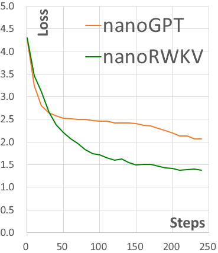
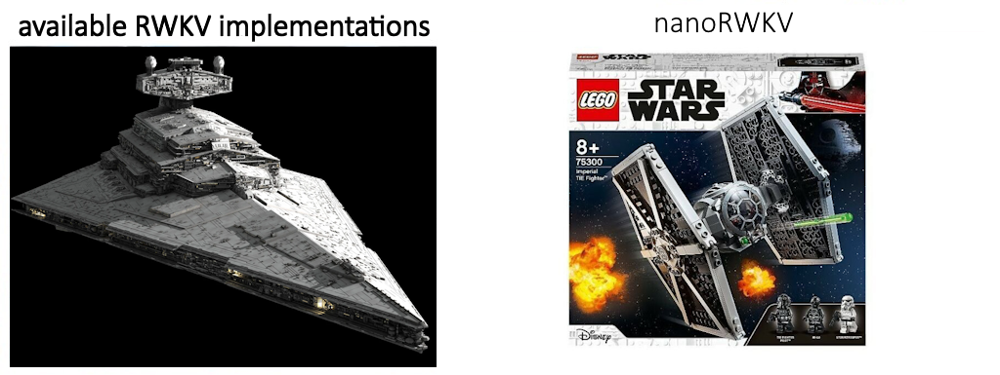
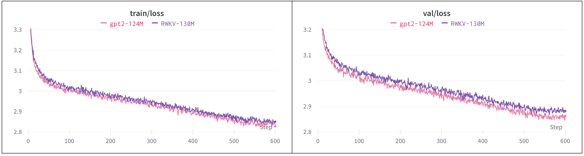
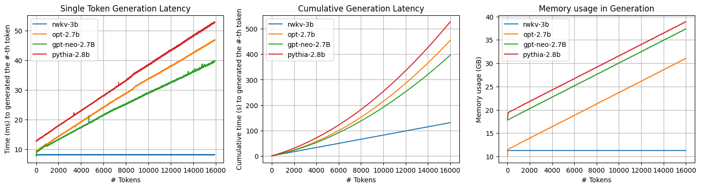
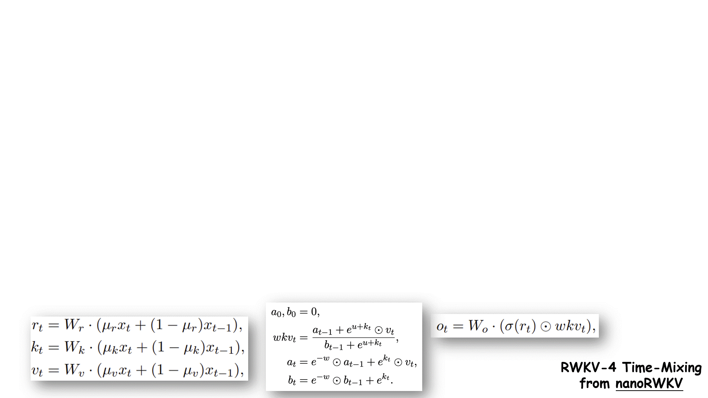
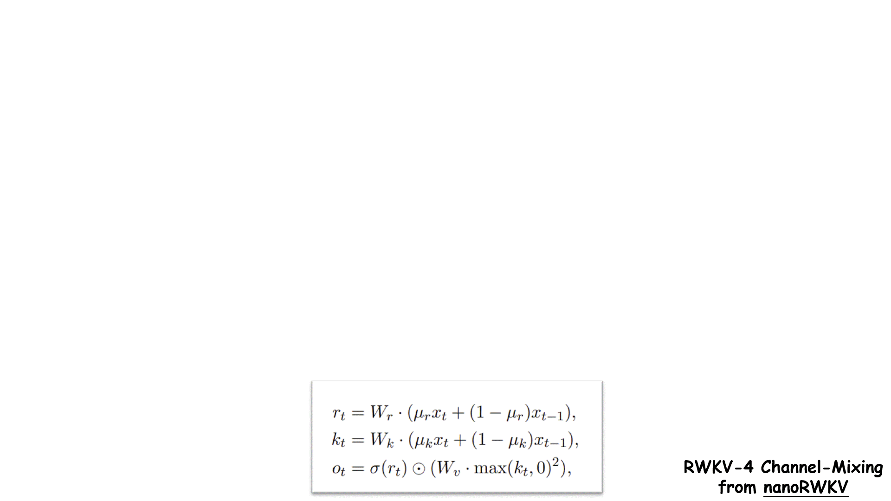

# MicroRWKV
This is a custom architecture for the nanoRWKV project from [RWKV-v4neo](https://github.com/BlinkDL/RWKV-LM/tree/main/RWKV-v4neo). The architecture is based on the original nanoRWKV architecture, but with some modifications.



This is RWKV "x051a" which does not require custom CUDA kernel to train, so it works for any GPU / CPU.



> The [nanoGPT](https://github.com/karpathy/nanoGPT)-style implementation of [RWKV Language Model](https://www.rwkv.com) - an RNN with GPT-level LLM performance.

Dataset used - [TinyStories](https://arxiv.org/abs/2305.07759)



RWKV is essentially an RNN with unrivaled advantage when doing inference. Here we benchmark the speed and space occupation of RWKV, along with its Transformer counterpart (code could be found [here](https://github.com/AnshulRanjan2004/MicroRWKV/blob/main/benchmark_inference_time.py)). We could easily find:
- single token generation latency of RWKV is an constant.
- overall latency of RWKV is linear with respect to context length.
- overall memory occupation of RWKV is an constant.



## Prerequisites
Before kicking off this project, make sure you are familiar with the following concepts:
- **RNN**: RNN stands for Recurrent Neural Network. It is a type of artificial neural network designed to work with sequential data or time-series data. Check this [tutorial](http://karpathy.github.io/2015/05/21/rnn-effectiveness/) about RNN.
- **Transformer**: A Transformer is a type of deep learning model introduced in the paper [Attention is All You Need](https://arxiv.org/abs/1706.03762). It is specifically designed for handling sequential data, like natural language processing tasks, by using a mechanism called self-attention. Check this [post](http://jalammar.github.io/illustrated-transformer/) to know more about Transformer.
- **LLM**: LLM, short for Large Language Model, has taken the world by storm. Check this [Awesome-LLM repo](https://github.com/Hannibal046/Awesome-LLM) and [State of GPT](https://build.microsoft.com/en-US/sessions/db3f4859-cd30-4445-a0cd-553c3304f8e2).
- **nanoGPT**: the simplest, fastest repository for training/finetuning medium-sized GPTs by great [Andrej Karpathy](https://karpathy.ai). Here you could find the [code](https://github.com/karpathy/nanoGPT) and the [teaching video](https://www.youtube.com/watch?v=kCc8FmEb1nY).
- **RWKV Language Model**: an RNN with GPT-level LLM performance, which can also be directly trained like a GPT transformer (parallelizable). The model is created by an independent researcher [Bo Peng](https://twitter.com/BlinkDL_AI). Get more information [here](https://www.rwkv.com).

## Model Structure
RWKV_TimeMix -> RWKV_ChannelMix -> Sliding Window Attention -> GroupedQAttention -> TinyMoE

Here is a brief description of each component:
1. RWKV_TimeMix: This component applies a time-based mixing operation to the input, which helps the model capture temporal dependencies.
2. RWKV_ChannelMix: The channel-based mixing operation is performed in this module, allowing the model to learn better representations across different feature channels.
3. Sliding Window Attention: This attention mechanism operates on a sliding window of the input, enabling the model to efficiently capture local and global dependencies.
4. GroupedQAttention: This attention module applies a grouped approach to the query, key, and value computations, improving the model's ability to capture multi-headed attention.
5. TinyMoE: The Tiny Mixture of Experts (TinyMoE) layer is a lightweight and efficient implementation of a Mixture of Experts (MoE) mechanism, which can help the model learn specialized representations.

## Detailed Explanation
1. RWKV_TimeMix:
This module applies a time-based mixing operation to the input, which helps the model capture temporal dependencies.
It uses several learnable parameters, such as `time_maa_k`, `time_maa_v`, `time_maa_r`, and `time_maa_g`, to control the mixing process.
The module also applies a time-decay mechanism using the time_decay parameter, which allows the model to give more importance to recent inputs.
The output of this module is then passed through a series of linear layers, including the receptance, key, value, and gate layers.

### Time Mixing


2. RWKV_ChannelMix:
This module performs a channel-based mixing operation on the input, allowing the model to learn better representations across different feature channels.
It uses a time-shift operation and learnable parameters, such as `time_maa_k` and `time_maa_r`, to control the mixing process.
The module applies a key, value, and receptance linear layers to the mixed input, and the output is then passed through a sigmoid activation function.

### Channel Mixing


3. Sliding Window Attention:
This attention mechanism operates on a sliding window of the input, enabling the model to efficiently capture both local and global dependencies.
The module computes the query, key, and value matrices using a linear layer, and then applies a sliding window attention operation to the input.
The output of the sliding window attention is then passed through a final linear layer to produce the final output.

4. GroupedQAttention:
This attention module applies a grouped approach to the query, key, and value computations, improving the model's ability to capture multi-headed attention.
The module first computes the query, key, value, and weight matrices using a single linear layer, and then splits these matrices into groups.
The attention computation is then performed on each group, and the results are concatenated and passed through a final linear layer.

5. TinyMoE:
The Tiny Mixture of Experts (TinyMoE) layer is a lightweight and efficient implementation of a Mixture of Experts (MoE) mechanism, which can help the model learn specialized representations.
The module computes attention scores using a linear layer, and then applies these scores to a set of expert networks to produce the final output.
The module also includes an auxiliary loss term that encourages the experts to learn diverse representations, improving the overall performance of the model.

## Usage (Inference)
To use this model for inference, you can follow these steps:
1. Download and paste model weights in the `out` directory.
2. Copy and paste the values like: `block_size`, `vocab_size`, etc from the table into the class GPTConfig in `generate.py`.
3. Then run the following command:
```python
python generate.py --prompt="One day" --max_num_tokens=50 --model_name="ckpt-500"
```
Explain: 
This command will generate text based on the input prompt "One day" using the model weights stored in the `out` directory. The `max_num_tokens` parameter specifies the maximum number of tokens to generate, and the `model_name` parameter specifies the name of the model weights file to load. For `model_name`, you can specify the name of the model weights file without the extension, like "ckpt-500" or "ckpt-1000" or only "ckpt".

## Tables
| name_model   | BLOCK_SIZE | VOCAB_SIZE | N_LAYER | N_HEAD | N_EMBD | NUM_EXPERTS | NUM_ACTIVE_EXPERTS | EXPERT_DIM | DIM | DROPOUT | BIAS  | DATASET         |
|--------------|------------|------------|---------|--------|--------|-------------|--------------------|------------|-----|---------|-------|-----------------|
| ckpt-500.pth | 1024       | 50304      | 8       | 8      | 768    | 4           | 4                  | 512        | 768 | 0.0     | False | tinystories_15k |

## Results
Prompt: One day

Generated text: One day: Sharing positive bought Isabel a rainbow hug. Her name was an vitamins, so only one favorite thing to cheer she were.

Lily picked up a hay and proudly went to a small portion. She was very happened. When Tommy said it

Generated text length: 227 | Inference time: 3 seconds

We got the results as follows 


| model | params | train loss | val loss |
| ----- | ------ | ---------- | -------- |
| GPT-2 | 124M   |  2.82      |  2.86    |
| RWKV  | 130M   |  2.85      |  2.88    |


### baselines

Existing OpenAI GPT-2 checkpoints and RWKV checkpoints allow us to get some baselines in place for openwebtext. We can get the numbers as follows:
```
python train.py config/eval_rwkv4_{169m|430m|1b5|3b|7b|14b}.py
python train.py config/eval_gpt2{|_medium|_large|_xl}.py
```
and observe the following losses on val set:
|    model   | RWKV |      |      |      |      |      | GPT-2 |      |      |      |
|:----------:|:----:|:----:|:----:|:----:|------|------|:-----:|:----:|:----:|:----:|
| parameters | 169M | 430M | 1.5B |  3B  | 7B   | 14B  |  124M | 350M | 774M | 1.5B |
|  val loss  | 3.11 | 2.79 | 2.54 | 2.42 | 2.32 | 2.23 |  3.11 | 2.82 | 2.66 | 2.56 |

Notice that both models are not trained in the openwebtext (RWKV in The Pile and OpenAI GPT-2 in private WebText), so they could be further improved due to dataset domain gap.

## Dependencies
- torch
- numpy
- tiktoken

## Conclusion
The MicroRWKV model is a custom neural network architecture that combines several cutting-edge techniques, such as time-based and channel-based mixing, sliding window attention, grouped attention, and a Tiny Mixture of Experts (TinyMoE) layer. These components work together to enhance the model's ability to capture both local and global dependencies, as well as to learn specialized representations. The combination of these techniques results in a powerful and efficient model that can be used for a variety of natural language processing tasks.

## Reference
Here are some useful references (offering my sincerest gratitude):
- [nanoGPT](https://github.com/karpathy/nanoGPT) - The original nanoGPT implementation by [Andrej Karpathy]
- [RWKV: Reinventing RNNs for the Transformer Era](https://arxiv.org/abs/2305.13048) - the paper
- [How the RWKV language model works](https://johanwind.github.io/2023/03/23/rwkv_details.html) - a great blog post by [Johan Sokrates Wind](https://www.mn.uio.no/math/english/people/aca/johanswi/index.html).
- [Investigating the RWKV Language Model](https://ben.bolte.cc/rwkv-model) - a great post by [Ben Bolte](https://ben.bolte.cc)
- [An Attention Free Transformer](https://arxiv.org/abs/2105.14103) - a paper from Apple that inspires RWKV.
- [RWKV-in-150-lines](https://github.com/BlinkDL/ChatRWKV/blob/main/RWKV_in_150_lines.py)
- [nanoT5](https://github.com/PiotrNawrot/nanoT5) - a follow-up of nanoGPT for T5 model
- [有了Transformer框架后是不是RNN完全可以废弃了？](https://www.zhihu.com/question/302392659/answer/2954997969) - a great answer by [Songlin Yang](https://sustcsonglin.github.io)
- [RWKV的RNN CNN二象性](https://zhuanlan.zhihu.com/p/614311961) - a great zhihu post by [Songlin Yang](https://sustcsonglin.github.io)
- [Google新作试图“复活”RNN：RNN能否再次辉煌？](https://kexue.fm/archives/9554) - a great blog post by [苏剑林](https://kexue.fm/me.html)
